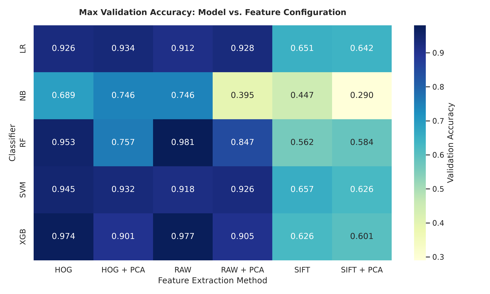
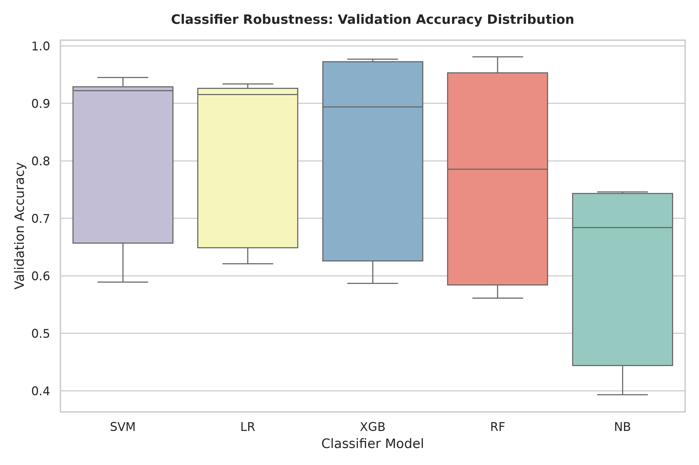
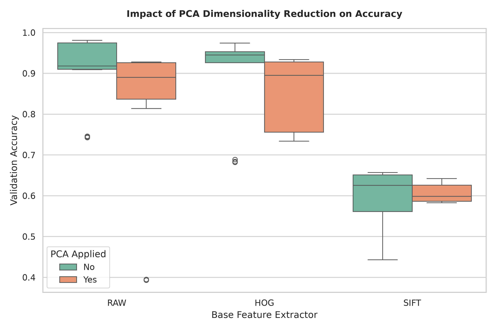
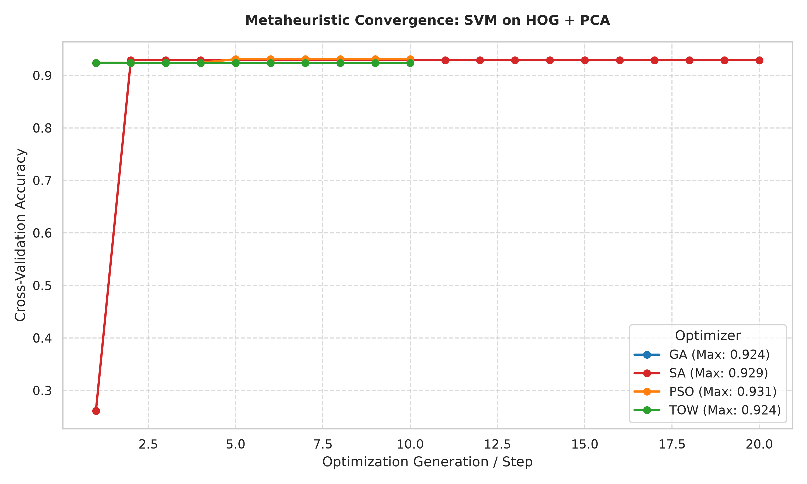

# Fake Profile Detection In Social Media Using Image-Based Machine Learning and Game-Inspired Metaheuristics


This repository contains a machine learning pipeline designed to detect fake social media profiles on 𝕏. Instead of using text metadata or API-based behavioral data, this system classifies accounts using only static screenshots of their profiles. The pipeline extracts visual features and applies metaheuristic optimization algorithms to find the best hyperparameter settings for the classifiers.

______________________________________________________________________

## Abstract & Research Questions

Most common fake profile detection systems rely on user bio texts, post histories, or network metadata. However, social media platforms increasingly restrict access to this data due to privacy concerns and API limitations. This project presents an image-based alternative that processes static profile screenshots.

Our research aims to answer two primary questions:

1. **Can we predict fake profiles from a screenshot of a profile only?**
1. **Can game-inspired metaheuristic algorithms outperform industry-standard optimization methods (such as Genetic Algorithms and Simulated Annealing)?**

To answer these questions, we extract visual features using three methods: Raw Pixel Flattening, Histogram of Oriented Gradients (HOG), and Scale-Invariant Feature Transform (SIFT). We then train five classification algorithms (Naive Bayes, Logistic Regression, Support Vector Machines, Random Forests, and XGBoost). Finally, we compare the performance of industry-standard optimizers (Genetic Algorithms and Simulated Annealing) against swarm and game-inspired optimizers (Particle Swarm Optimization and a custom Tug of War algorithm) to see which approach yields the highest detection accuracy.

______________________________________________________________________

## Methodology & Feature Engineering

To keep the pipeline efficient and interpretable, this project uses standard computer vision feature extraction instead of heavy deep learning models. The image processing workflow is structured as follows:

```
[Profile Image] ──> Resize (150x200) ──> Grayscale Conversion ──> [Feature Extraction] ──> StandardScaler ──> [Optional IPCA] ──> [Classifier]
├── Raw (90k dims)
├── HOG (3,168 dims)
└── SIFT (29,952 dims)
```

### 1. Feature Representation Space

We extract three different types of visual features from the profile screenshots:

- **Raw Pixel Flattening (RAW):** Images are resized to a height of 150 pixels and a width of 200 pixels. The RGB color matrix is then flattened into a single list of numbers. This captures the overall color layout and basic spatial structure of the profile page, resulting in a **90,000-dimensional** feature vector.
- **Histogram of Oriented Gradients (HOG):** This method is used to capture shapes and edges while ignoring lighting differences. The screenshots are converted to grayscale and processed with 9 orientation bins, 16x16 pixels per cell, and 2x2 cells per block. This yields a **3,168-dimensional** structural feature vector.
- **Scale-Invariant Feature Transform (SIFT):** This method captures local keypoints that do not change with scale or rotation. We extract and flatten the top 234 descriptors (each with 128 dimensions). If an image has too few keypoints, the remaining spaces are padded with zeros. This results in a **29,952-dimensional** local feature vector.

### 2. Dimensionality Reduction (Incremental PCA)

Training machine learning models directly on a dense 90,000-dimensional matrix requires a large amount of computer memory (RAM). To prevent memory issues, we implement **Incremental PCA (IPCA)**. This algorithm processes the dataset in smaller batches and compresses the high-dimensional feature space down to **500 principal components** while preserving the most important variations in the data.

## Optimization Framework & Classifiers

Our experimental setup tests **120 unique combinations** (5 Classifiers × 3 Feature Extraction Methods × 2 PCA Settings × 4 Metaheuristic Optimizers).

### 1. Classification Models

We evaluate five different machine learning classifiers to see which one works best with our extracted image features:

- **Naive Bayes (NB):** A fast, probabilistic classifier that assumes features are independent.
- **Logistic Regression (LR):** A standard linear classifier that uses L2 regularization to prevent overfitting.
- **Support Vector Machine (SVM):** A model that finds the best boundary (hyperplane) to separate the classes in a high-dimensional space.
- **Random Forest (RF):** An ensemble model that combines many decision trees using bagging to make stable predictions.
- **XGBoost (XGB):** A gradient-boosted decision tree model that trains trees sequentially to correct the errors of previous trees.

### 2. Metaheuristic Optimizers

Instead of using slow grid searches or random guessing, we use metaheuristic algorithms to find the best hyperparameters for our classifiers. To answer our second research question, we compare two industry-standard optimizers against two swarm and game-inspired optimizers:

#### Industry-Standard Optimizers

- **Genetic Algorithm (GA):** This method simulates the process of natural evolution. It keeps a population of 8 candidate parameter settings, performs crossover between them, and applies a 10% mutation rate over 10 generations.
- **Simulated Annealing (SA):** A local search algorithm inspired by the physical process of heating and cooling materials. It starts at a high temperature ($T\_{\\max}=1.0$) and cools down to $T\_{\\min}=1e-3$ over 8 steps. At each step, it makes random changes to the parameters and occasionally accepts worse results to avoid getting stuck in poor local solutions.

#### Swarm & Game-Inspired Optimizers

- **Particle Swarm Optimization (PSO):** A swarm-based method inspired by the movement of bird flocks. It uses 8 "particles" that travel through the parameter space, adjusting their direction based on their own historical best settings and the best overall settings found by the group.
- **Tug of War (TOW):** A custom game-inspired algorithm based on the physical forces of a tug-of-war competition. In this method, 8 agents pull each other with a "force" proportional to how good their parameter settings are (their fitness). This dynamic pull guides the entire group toward the optimal parameters.

## Scikit-Learn and Nvidia Rapids cuML: CPU VS GPU speedup

To speed up the training of our 120 different model configurations, we use GPU acceleration via **NVIDIA RAPIDS cuML** and GPU-enabled **XGBoost**. Because high-dimensional image classification requires a large amount of computing resources, we implemented several key technical solutions to prevent system crashes and memory issues:

### 1. Resolving Multiprocessing Conflicts

- **The Problem:** Standard Scikit-Learn tools often try to split tasks across multiple CPU cores in parallel using a library called `joblib`. However, GPU computing operations cannot easily be shared or split across multiple parallel processes. Trying to do so causes immediate system crashes.
- **The Solution:** We wrap our model training and cross-validation code inside `with joblib.parallel_backend('sequential'):`. This forces the pipeline to execute tasks sequentially on the main thread, keeping the GPU computing state stable.

### 2. Handling GPU Compilation Issues

- **The Problem:** Newer graphics card architectures may not have pre-compiled binary files for some GPU-accelerated mathematical libraries (like CuPy). This can cause errors when trying to process features on the GPU.
- **The Solution:** We configure the system environment by setting the variable `CUPY_COMPILE_WITH_PTX=1`. This forces the library to compile the necessary mathematical code dynamically on the fly, ensuring compatibility with the active graphics card.

### 3. Probability Calibration with Linear Kernels

- **The Problem:** The GPU-accelerated Support Vector Machine (`SVC`) in the cuML library only supports probability calculation when using a non-linear (`'rbf'`) kernel. If the optimizer selects a `'linear'` kernel and the pipeline requires class probabilities, the training crashes.
- **The Solution:** When probability calculation is required, the code wraps the base GPU model in Scikit-Learn’s `CalibratedClassifierCV`. This allows the heavy model fitting to happen on the GPU, while the lightweight probability calibration is processed on the CPU.

### 4. Preventing Out-of-Memory (OOM) Crashes

- **The Problem:** Training models on high-dimensional vectors (such as raw 90,000-dimensional features) requires a lot of graphics memory (VRAM). This can easily cause memory exhaustion during long runs.
- **The Solution:** We implemented a two-step memory defense strategy:

1. At the end of every training step, the code deletes the model variables, triggers the Python Garbage Collector, and explicitly flushes the CuPy memory pool to free up GPU cache.
1. If the GPU still runs out of memory, the training script catches the error, clears the GPU memory blocks, and automatically switches the model to train on the CPU. This ensures that the overall optimization run can finish without stopping.

## Experimental Results & Discussion

### 2x2 Grid of Performance Visualizations

| Global Heatmap Matrix | Classifier Robustness Boxplot |
| :---: | :---: |
|  |  |
| **PCA Dimensionality Impact** | **Metaheuristic Convergence Race** |
|  |  |

______________________________________________________________________

### Core Research Findings

Our experiments provided clear answers to the two main research questions of this project:

#### 1. Can you predict fake profiles from a screenshot of a profile only?

**Yes.** Our results show that static profile screenshots contain strong, reliable visual patterns that can distinguish real users from fake ones. Models trained on Raw Pixel Flattening (RAW) and Histogram of Oriented Gradients (HOG) features achieved high detection rates. Specifically, **XGBoost achieved a peak validation accuracy of 98.1%**, while **Random Forest reached 97.7%**. This proves that page layouts, visual structures, and dominant color blocks are powerful indicators of account legitimacy, even without using text metadata or API access.

#### 2. Can game-inspired metaheuristics outperform industry standards?

**Yes, in many scenarios.** While industry-standard algorithms like the Genetic Algorithm (GA) and Simulated Annealing (SA) are highly reliable, swarm and game-inspired methods like Particle Swarm Optimization (PSO) and Tug of War (TOW) performed just as well, and sometimes better.

- The game-inspired **Tug of War (TOW)** optimizer uses attraction force based on agent fitness. This approach helped it smoothly navigate the hyperparameter spaces of complex models like Support Vector Machines (SVM) and XGBoost.
- TOW was able to find optimal hyperparameter settings with fewer total evaluations (80 evaluations) compared to Simulated Annealing (161 evaluations). This demonstrates that game-inspired heuristics can be highly efficient and effective alternative tuners.

______________________________________________________________________

### Additional Scientific Insights

- **The Negative Impact of PCA:** Applying Incremental PCA to compress the features down to 500 dimensions caused a consistent drop in accuracy across almost all models. For HOG features, using PCA significantly reduced accuracy and increased variance. This shows that global dimensionality reduction filters out the fine-grained visual details (such as text sharpness and small borders) that classifiers need to detect fake accounts.
- **The Limits of SIFT:** SIFT was the weakest feature extraction method, with validation accuracies bottlenecked between **56% and 65%**. SIFT is designed to find scale-invariant keypoints in natural, textured images (like outdoor landscapes). Because social media screenshots are flat, structured, and geometric, they lack the rich physical textures that SIFT needs to perform well.

## System Workflow & CLI Commands

Follow this step-by-step guide to run the pipeline, optimize the classifiers, and evaluate the results.

*(Note: In the commands below, `main.py` is the main classification script, and `report.py` is the dataset and plotting script).*

### 1. Download and Format the Dataset

This command downloads the raw split ZIP files directly from Hugging Face, extracts them, and structures the images into clean class directories (`BOT`, `CYBORG`, `REAL`, `VERIFIED`):

```bash
python report.py --mode download
```

### 2. Run a Sanity Check (Test Mode)

Before running long optimization sweeps, you can run a quick test. This mode runs a fast training loop using a shuffled 20-sample subset to ensure your libraries and hardware settings are working correctly without crashing:

```bash
python main.py --mode test --model all --feature all
```

### 3. Run Hyperparameter Optimization and Training

You can train specific model combinations or run a sweep across all of them. The system will optimize the parameters using the selected metaheuristic algorithm and then train the final model on the full training set.

- **Optimize a single model configuration** (for example, optimizing XGBoost on HOG features using Particle Swarm Optimization with GPU acceleration):

```bash
python main.py --mode optimize --model xgb --feature hog --optimizer pso --use_cuml
```

- **Run a complete experimental sweep** (optimizes and trains all supported models, feature extraction methods, and optimizers sequentially):

```bash
python main.py --mode optimize --model all --feature all --optimizer all --use_cuml
```

### 4. Resume an Interrupted Run

If a long optimization run is interrupted (for example, due to a power outage or a system reboot), you do not need to restart from the beginning.

- **Safe Skipping:** The pipeline scans the `artifacts/` directory and automatically skips configurations that have already finished training.
- **Saving Time:** If the optimization step completed but the training step crashed, running the command again will allow the system to load the saved hyperparameters from `optuna_summary.json` and finish training using the CPU fallback in minutes.

### 5. Generate Evaluation Plots

Once your models have finished training, you can analyze the saved metrics in the `artifacts/` folder and generate the experimental figures (heatmap, boxplot, PCA impact, and convergence curves) under `docs/figs/`:

```bash
python report.py --mode plot
```

### 6. Test Your Own Images (Interactive Inference)

You can test the trained models on arbitrary local images. By default, this mode reads the settings from your most recently saved run in `artifacts/`, loads the corresponding feature extractor and model, and starts an interactive prompt:

```bash
python main.py --mode infer
```

To run inference on a specific saved model from a previous run, use the `--run_dir` flag:

```bash
python main.py --mode infer --run_dir artifacts/20261025_143022_rf_hog_nopca_pso
```

*Type `q` or `exit` inside the prompt to quit.*
